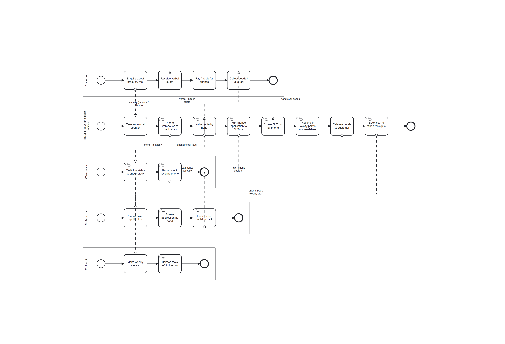

# Strategic Business Process Model — ProBuild AS-IS

**File:** `src/main/resources/strategic/strategic_asis.bpmn` (+ `.png`)

This is the **AS-IS** (current-state) strategic model of how ProBuild operates *before* automation.
It is intentionally modelled at the business level with **manual/human tasks** and cross-pool
hand-offs that are, in reality, **phone calls and faxes** — capturing the pain the project sets out
to remove (BPMN 2.0; OMG, 2013).

## The five actors and the manual hand-offs

| Pool | Current manual work | Hand-off to the next actor |
|---|---|---|
| **Customer** | Enquire → receive a *verbal* quote → pay / apply for finance → collect goods | enquiry is made *in store or by phone* |
| **ProBuild** (counter & back office) | Take enquiry → **phone the warehouse** → **write the quote by hand** → **fax the finance application** → **chase FinTrust by phone** → **reconcile loyalty points in a spreadsheet** → release goods → **book FixPro when tools pile up** | verbal quote to customer; fax to FinTrust; phone to warehouse & FixPro |
| **Warehouse** | Walk the aisles to check stock → report the level by phone | phone the level back to the counter |
| **FinTrust UK** | Receive the faxed application → assess by hand → fax / phone the decision back | fax / phone decision to ProBuild |
| **FixPro Ltd** | Make a weekly site visit → service whatever tools are left in the bay | — |

## Why this is the problem the automation solves

Every hand-off in the AS-IS model is a **manual, point-to-point communication** with no shared view
of state — the exact issues named in the brief:

| AS-IS pain (strategic model) | TO-BE resolution (operational model) |
|---|---|
| Stock checked by **phoning the warehouse** | `sales-check-inventory` reads live `INVENTORY` |
| Quotes **written by hand, ad hoc** | `Cap_Sales` prices from the same live data |
| Finance **faxed and chased by phone** | `finance.requested`/`finance.settled` **messages** to the `Partner_FinTrust` pool |
| Loyalty **reconciled in a spreadsheet after the fact** | `Cap_Loyalty` + `loyalty_band` DMN, in-line |
| Tools **wait in the bay until someone books FixPro** | `service.requested` message auto-starts `Partner_FixPro` |
| **No shared view** of any order/hire/application | one `journeyId` correlates every pool end-to-end |

The strategic model therefore establishes the requirement each element of the operational model
fulfils — the through-line from *problem* to *automated solution*.
