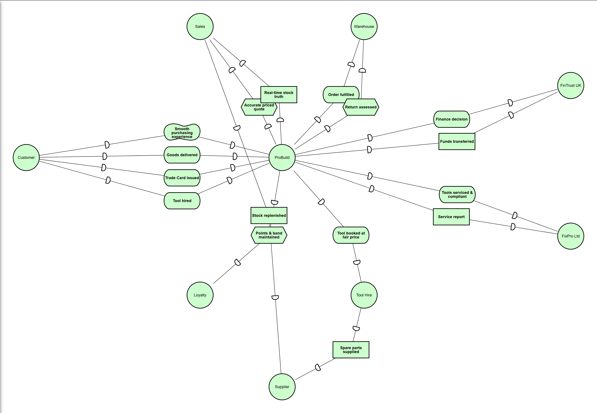

# iStar 2.0 — Strategic Dependency (SD) Model

**Pistar source:** `SD-model.txt` · **Tool:** Pistar 2.1.0 (Dalpiaz, Franch and Horkoff, 2016)

## Reading the model

Nine actors. **ProBuild** is modelled as the **orchestrator hub**: it depends on four *internal
capability agents* (Sales, Warehouse, Loyalty, Tool Hire) and on two *external partner agents*
(FinTrust UK, FixPro Ltd), while the **Customer** depends on ProBuild for the outcomes it cares
about. The two external partners are reachable only through dependencies that become **correlated
messages** at runtime — never internal calls — reflecting the real organisational boundary.

| Dependency (dependum) | Kind | Depender → Dependee |
|---|---|---|
| Smooth purchasing experience | Quality (softgoal) | Customer → ProBuild |
| Goods delivered / Trade Card issued / Tool hired | Goal | Customer → ProBuild |
| Accurate priced quote | Task | ProBuild → Sales |
| Real-time stock truth | Resource | ProBuild → Sales |
| Order fulfilled / Return assessed | Goal / Task | ProBuild → Warehouse |
| Points & band maintained | Task | ProBuild → Loyalty |
| Tool booked at fair price | Goal | ProBuild → Tool Hire |
| Finance decision / Funds transferred | Goal / Resource | ProBuild → FinTrust UK |
| Tools serviced & compliant / Service report | Goal / Resource | ProBuild → FixPro Ltd |
| Stock replenished / Spare parts supplied | Resource | Sales, Tool Hire → Supplier |

Every dependency maps directly onto the operational platform: a call-activity contract for the
internal capabilities, a correlated message for the external partners (see `docs/istar-model.md` §4
for the full traceability table).
