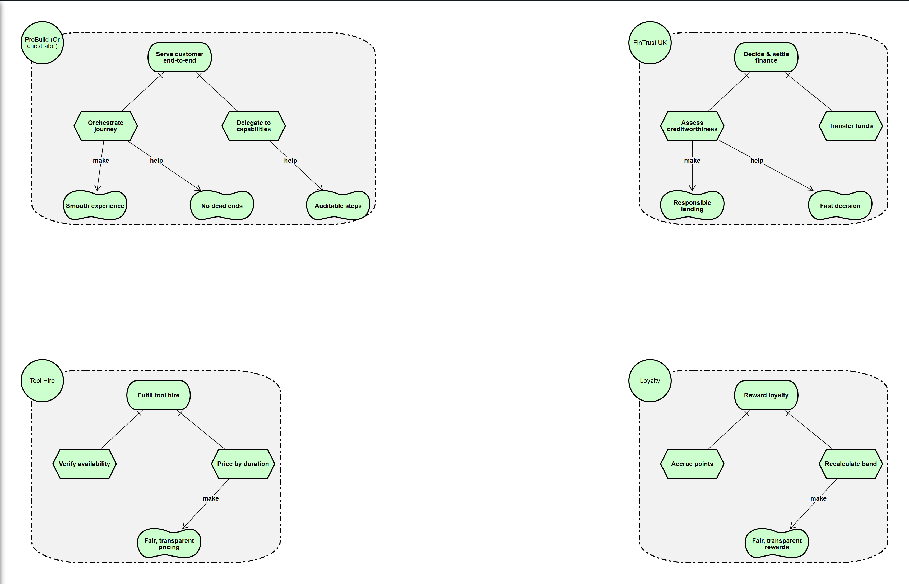

# iStar 2.0 — Strategic Rationale (SR) Model

**Pistar source:** `SR-model.txt` · **Tool:** Pistar 2.1.0 (Dalpiaz, Franch and Horkoff, 2016)

## Reading the model

The SR view opens each actor's boundary to show *why* it performs its tasks — a root **hard goal**
AND-refined into **tasks**, with **contribution links** (`make`/`help`) to the **qualities**
(softgoals) that shape how the work is done.

- **ProBuild (Orchestrator):** *Serve customer end-to-end* → *Orchestrate journey* + *Delegate to
  capabilities*; contributions **make** *Smooth experience* and **help** *No dead ends* / *Auditable
  steps*.
- **FinTrust UK:** *Decide & settle finance* → *Assess creditworthiness* + *Transfer funds*; *Assess
  creditworthiness* **makes** *Responsible lending* and **helps** *Fast decision* — the two softgoals
  are in tension, resolved by a DMN recommendation confirmed by a human.
- **Tool Hire:** *Fulfil tool hire* → *Verify availability* + *Price by duration*; *Price by
  duration* **makes** *Fair, transparent pricing* (realised by the `hire_pricing` DMN table).
- **Loyalty:** *Reward loyalty* → *Accrue points* + *Recalculate band*; *Recalculate band* **makes**
  *Fair, transparent rewards* (realised by the `loyalty_band` DMN table).

The **softgoal-conflict analysis** and the alternatives considered are set out in full in
`docs/istar-model.md`.
